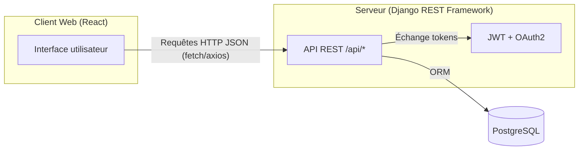
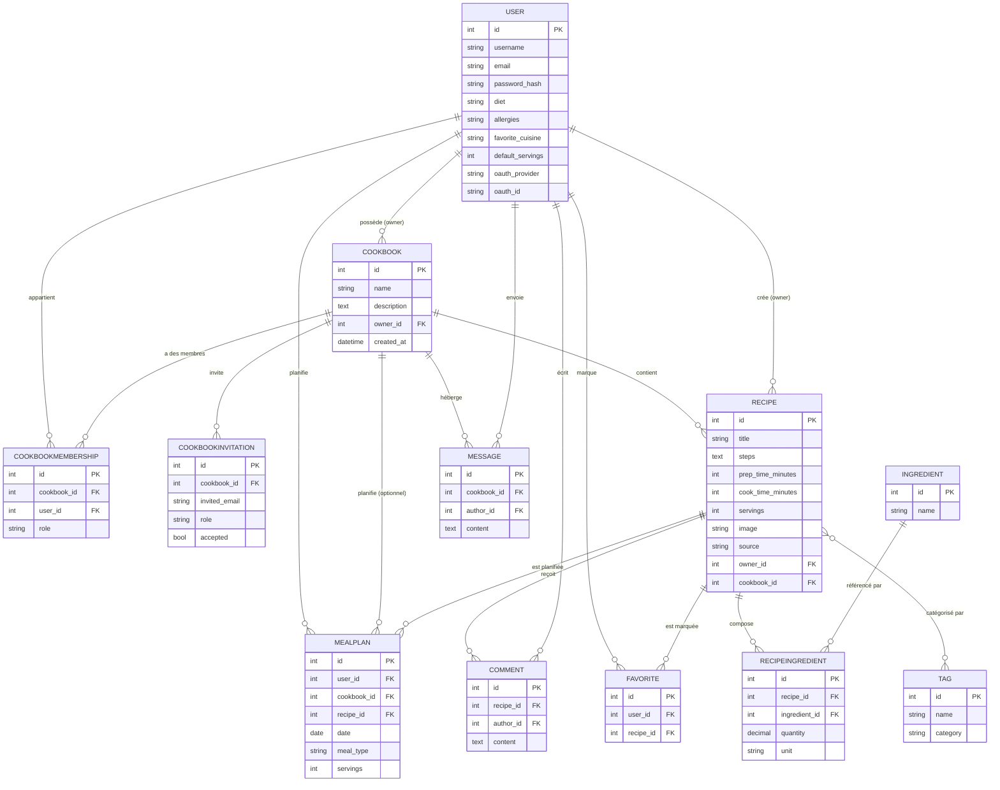
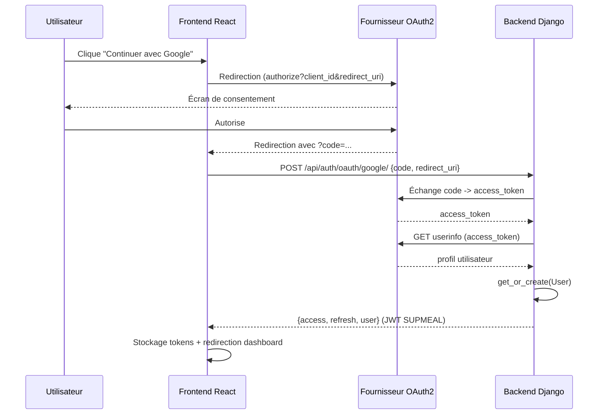
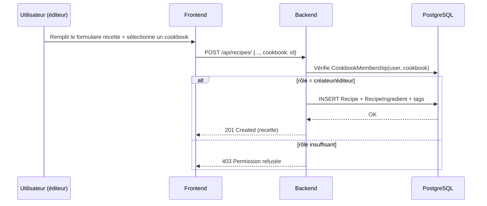
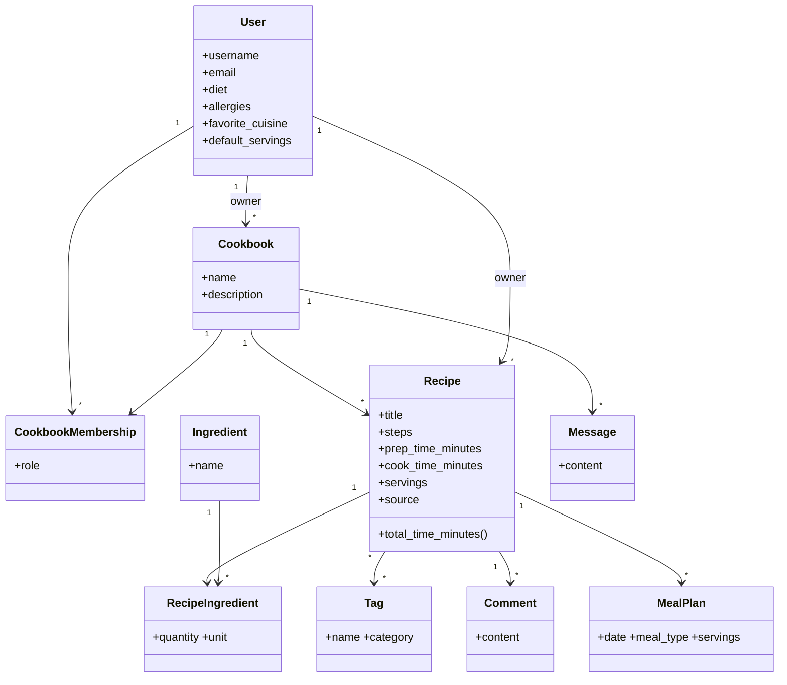

# SUPMEAL — Documentation technique

Application de gestion de recettes et de planification de repas.
Stack : **Django REST Framework** (API) + **React / Vite** (client web) + **PostgreSQL** (base de données), le tout containérisé via **Docker Compose**.

---

## 1. Architecture générale



Conformément au sujet (2.3.1) :
- **Aucune logique métier côté client** : React ne fait qu'appeler l'API REST et afficher/poster des données. Toutes les règles (permissions, calcul de liste de courses, agrégation, filtrage) sont exécutées côté serveur.
- Le serveur expose une **API REST** (Django REST Framework) versionnée sous `/api/`.
- La base de données est **PostgreSQL** en production/Docker (bascule automatique sur SQLite en développement local sans variables d'environnement postgres, pour faciliter les tests rapides).

### 1.1 - Découpage en applications Django (modularité)

| App | Responsabilité |
|---|---|
| `accounts` | Utilisateur custom, JWT, inscription, OAuth2, préférences culinaires |
| `cookbooks` | Cookbooks partagés, memberships, rôles, invitations |
| `recipes` | Recettes, ingrédients, tags, favoris, commentaires, filtrage |
| `planning` | Planification de repas, génération de liste de courses |
| `messaging` | Messagerie instantanée interne à un cookbook |
| `importexport` | Export/Import JSON (compatible Mealie) et CSV |

---

## 2. Choix techniques et justification

### Backend — Django REST Framework
- **Django** offre un ORM robuste, un système de migrations fiable et un admin auto-généré (utile pour la modération/le support).
- **DRF** fournit viewsets/serializers/permissions déclaratifs, réduisant fortement la duplication de code par rapport à des vues manuelles.
- **djangorestframework-simplejwt** : authentification stateless par JWT (access + refresh token), adaptée à une API consommée par un SPA.
- **django-filter** : filtrage déclaratif avancé (2.2.4) sans dupliquer de logique de requêtes dans chaque vue.
- **Pillow** : gestion des images de recettes/avatars.

### Frontend — React + Vite
- **Vite** : temps de démarrage et de build très rapides, configuration minimale.
- **React Router** : navigation SPA classique.
- **Axios** avec intercepteurs : centralise l'ajout du token JWT et le rafraîchissement automatique du token expiré (401 → refresh silencieux → rejeu de la requête), évitant de dupliquer cette logique dans chaque appel.
- Aucune librairie de composants lourde : CSS custom pour maîtriser totalement la charte graphique SUPMEAL (vert forêt / orange, cohérent avec l'univers culinaire).

### Base de données — PostgreSQL
- SGBD relationnel robuste, gère bien les contraintes d'unicité (ex : un utilisateur ne peut avoir qu'un seul rôle par cookbook), les index et les relations many-to-many nécessaires au modèle (recettes ↔ tags, recettes ↔ favoris).

### Authentification OAuth2
- Implémentation légère du flow "Authorization Code" : le frontend redirige vers le fournisseur (Google/GitHub/Microsoft), récupère le `code`, puis le poste à `/api/auth/oauth/<provider>/`. Le serveur échange ce code contre un token d'accès fournisseur, récupère le profil utilisateur, puis crée/retrouve le compte SUPMEAL correspondant et renvoie des tokens JWT SUPMEAL classiques. Cela évite une dépendance lourde type `django-allauth` tout en couvrant les 3 fournisseurs demandés.

---

## 3. Schéma de la base de données



**Optimisation des recherches** : la table `Ingredient` centralise les noms d'ingrédients (contrainte d'unicité + index) : les recettes référencent des `Ingredient` via `RecipeIngredient` plutôt que de dupliquer du texte libre. Cela permet un filtrage par ingrédient en `O(index)` plutôt que par scan de texte libre sur chaque recette, et évite la duplication de données (ex : "tomate" écrit différemment dans 50 recettes). Des index sont également posés sur `Recipe.title`, `Recipe.prep_time_minutes`, `Recipe.cook_time_minutes` et `Message(cookbook, created_at)` pour accélérer respectivement la recherche plein texte, le filtrage par temps, et la pagination du chat.

---

## 4. Diagrammes UML

### 4.1 Diagramme de cas d'utilisation (synthèse)

```mermaid
flowchart TB
    U((Utilisateur))
    U --> UC1[S'inscrire / se connecter (local ou OAuth2)]
    U --> UC2[Créer / gérer une recette]
    U --> UC3[Créer un cookbook et inviter des membres]
    U --> UC4[Filtrer / rechercher des recettes]
    U --> UC5[Planifier des repas]
    U --> UC6[Générer une liste de courses]
    U --> UC7[Commenter une recette]
    U --> UC8[Discuter dans la messagerie du cookbook]
    U --> UC9[Exporter ses données]
    U --> UC10[Importer des recettes]
    U --> UC11[Gérer ses préférences]
```

### 4.2 Diagramme de séquence — Authentification OAuth2



### 4.3 Diagramme de séquence — Ajout d'une recette dans un cookbook partagé



### 4.4 Diagramme de classes (simplifié)



---

## 5. Sécurité

- Mots de passe **jamais stockés en clair** : hashing via `set_password()` (PBKDF2 par défaut Django).
- Authentification par **JWT signé** (durée de vie courte pour l'access token, rotation du refresh token).
- Permissions vérifiées côté serveur à chaque action sensible (édition/suppression de recette, invitation, changement de rôle, envoi de message) — jamais côté client uniquement.
- Aucun secret n'est commité : toutes les clés (Django `SECRET_KEY`, identifiants OAuth2, mots de passe DB) sont fournies via variables d'environnement (`.env`, non versionné).
- CORS restreint via `CORS_ALLOWED_ORIGINS` (mode `CORS_ALLOW_ALL=True` uniquement en développement).

---

## 6. Guide de déploiement

### Prérequis
- Docker et Docker Compose installés.

### Étapes

```bash
# 1. Cloner le dépôt
git clone https://github.com/seraphingambo697/SUPMAIL.git
cd supmeal

# 2. Configurer l'environnement
cp .env.example .env
# éditer .env si besoin (notamment les clés OAuth2, optionnelles)

# 3. Lancer l'application
docker compose up --build
```

- Frontend : http://localhost:3000
- API backend : http://localhost:8000/api/
- Admin Django : http://localhost:8000/admin/ (compte auto-créé si `DJANGO_CREATE_SUPERUSER=True` : `admin` / `admin1234` — **à changer immédiatement en production**)

### Variables d'environnement principales

| Variable | Description |
|---|---|
| `DJANGO_SECRET_KEY` | Clé secrète Django (obligatoire en production) |
| `DJANGO_DEBUG` | `True`/`False` |
| `POSTGRES_DB/USER/PASSWORD` | Identifiants base de données |
| `CORS_ALLOWED_ORIGINS` | Origines autorisées à appeler l'API |
| `GOOGLE_CLIENT_ID` / `GOOGLE_CLIENT_SECRET` | Identifiants app OAuth2 Google (créer un projet sur Google Cloud Console, redirect URI : `http://localhost:3000/oauth/callback/google`) |
| `GITHUB_CLIENT_ID` / `GITHUB_CLIENT_SECRET` | Identifiants OAuth App GitHub |
| `MICROSOFT_CLIENT_ID` / `MICROSOFT_CLIENT_SECRET` | Identifiants app Azure AD |

Le frontend lit également `VITE_GOOGLE_CLIENT_ID`, `VITE_GITHUB_CLIENT_ID`, `VITE_MICROSOFT_CLIENT_ID` (mêmes valeurs de client ID, publiques par nature dans le flow OAuth2 "Authorization Code").

### Développement sans Docker (optionnel)

```bash
# Backend
cd backend
python -m venv venv && source venv/bin/activate
pip install -r requirements.txt
python manage.py migrate
python manage.py runserver

# Frontend
cd frontend
npm install
npm run dev
```

---

## 7. Structure du dépôt

```
supmeal/
├── docker-compose.yml
├── .env.example
├── backend/
│   ├── manage.py
│   ├── requirements.txt
│   ├── Dockerfile
│   ├── entrypoint.sh
│   ├── supmeal/          # settings, urls, wsgi/asgi
│   ├── accounts/
│   ├── cookbooks/
│   ├── recipes/
│   ├── planning/
│   ├── messaging/
│   └── importexport/
├── frontend/
│   ├── src/
│   │   ├── api/          # client axios + refresh JWT
│   │   ├── context/      # AuthContext
│   │   ├── components/   # Layout, RecipeCard...
│   │   ├── pages/        # Login, Dashboard, Recipes, Cookbooks...
│   │   └── styles.css
│   ├── package.json
│   └── Dockerfile
├── README.md              (ce fichier)
└── USER_MANUAL.md
```

---

## 8. Endpoints principaux de l'API

| Méthode | Endpoint | Description |
|---|---|---|
| POST | `/api/auth/register/` | Inscription |
| POST | `/api/auth/login/` | Connexion (JWT) |
| POST | `/api/auth/login/refresh/` | Rafraîchir le token |
| GET/PATCH | `/api/auth/me/` | Profil / préférences |
| POST | `/api/auth/oauth/<provider>/` | Connexion OAuth2 |
| GET/POST | `/api/cookbooks/` | Lister / créer un cookbook |
| GET | `/api/cookbooks/<id>/search/?q=` | Recherche interne au cookbook |
| POST | `/api/cookbooks/<id>/invite/` | Inviter un membre |
| GET/POST | `/api/recipes/?cookbook=&tag=&ingredient=&max_prep_time=&max_cook_time=&favorite=&search=` | Lister/filtrer/créer des recettes |
| POST | `/api/recipes/<id>/toggle_favorite/` | Ajouter/retirer des favoris |
| GET/POST | `/api/recipes/<id>/comments/` | Commentaires d'une recette |
| GET/POST | `/api/meal-plans/` | Planning de repas |
| GET | `/api/meal-plans/shopping_list/?start=&end=` | Liste de courses générée |
| GET/POST | `/api/messages/?cookbook=` | Messagerie du cookbook |
| GET | `/api/export/?export_format=json\|csv` | Export des données |
| POST | `/api/import/` | Import de recettes/cookbooks |


